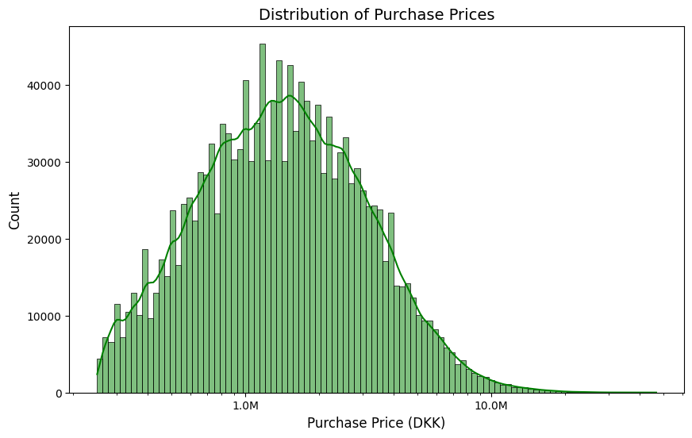
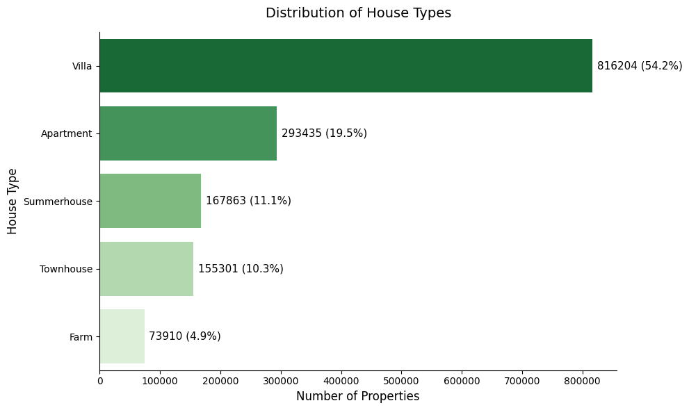
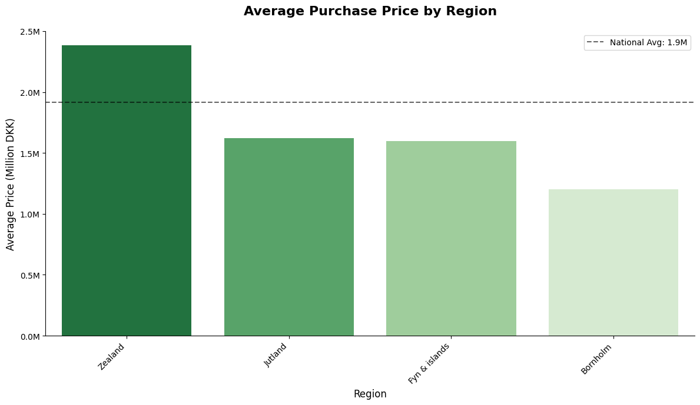
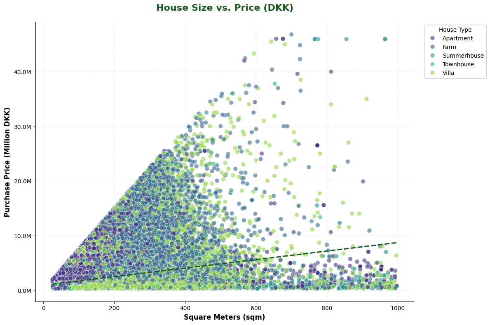
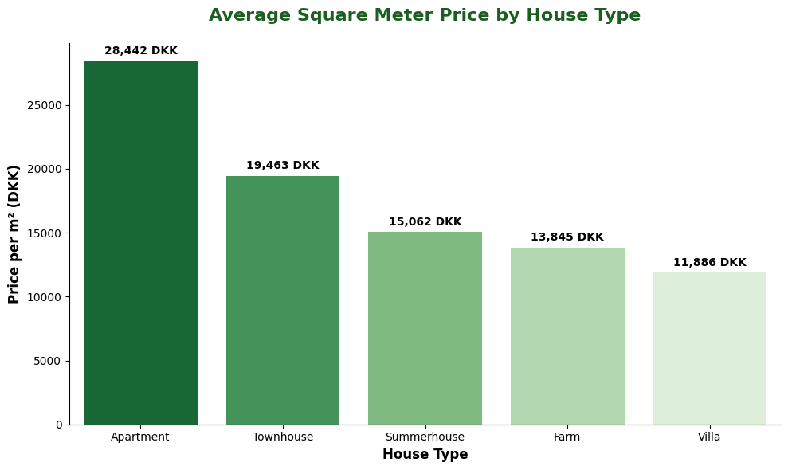
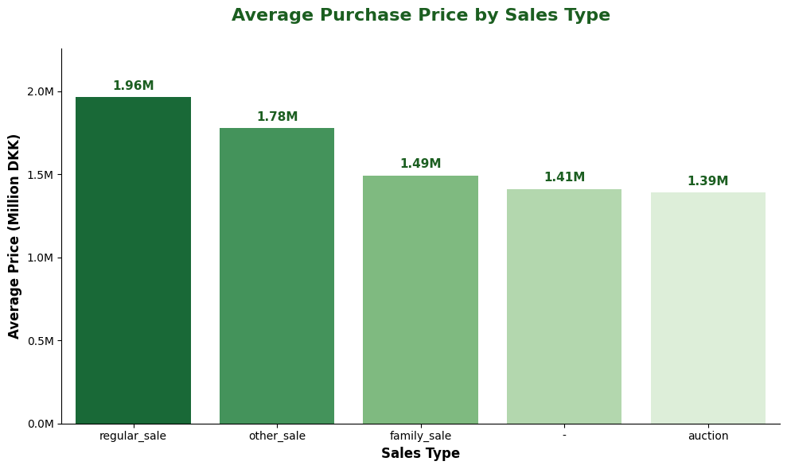
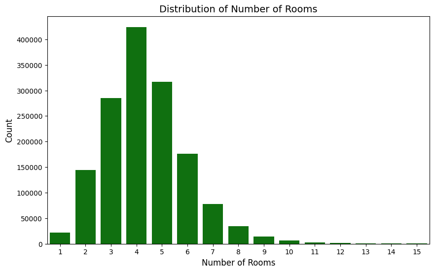
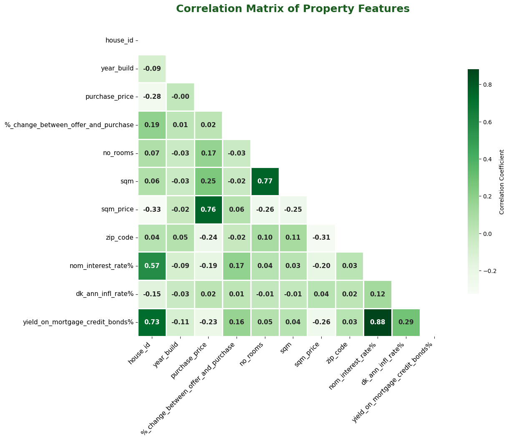
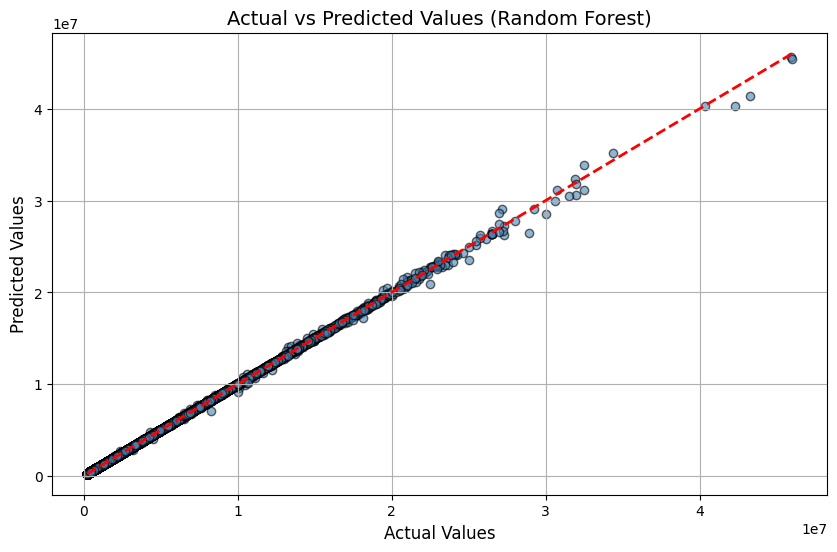

# 🏠 Danish Residential Housing Analysis

A minimal, end-to-end demo showing how to build a small analytical pipeline for housing transactions:
- Ingest CSV into a staging table
- Transform into a small dimensional model (date & property dimensions, sales fact)
- Run validation and simple analytics
- Explore results and build a Random Forest model in a notebook

## 🚀 Quickstart

1. Create a Python virtual environment and install dependencies:

```bash
python -m venv .venv
source .venv/bin/activate  # macOS / Linux
pip install -r requirements.txt
```

2. Run a quick sample extract (loads first 100 rows into staging):

```bash
python -c "from src import etl; etl.stage('Data/DKHousingPricesSample100k.csv', 'Data/warehouse.db', sample=100)"
```

3. Transform staging into the dimensional model and run validation:

```bash
python -c "from src import transform; transform.transform('Data/warehouse.db')"
```

4. Inspect the results (SQLite):

```bash
sqlite3 Data/warehouse.db "SELECT name FROM sqlite_master WHERE type='table';"
sqlite3 Data/warehouse.db "SELECT COUNT(*) FROM fact_sales;"
```

5. Run the demo notebook (shows ETL + EDA + plots):

- Open `Notebooks/etl_demo.ipynb` in Jupyter or run the script `python notebooks/etl_demo.py`.

## 📁 Project structure

- `Data/` — CSV sample and `warehouse.db` SQLite file
- `src/` — minimal ETL code
  - `src/etl.py` — extract CSV into `staging` table
  - `src/transform.py` — build `dim_date`, `dim_property`, `fact_sales`; **calls validation at the end and will raise on failures**
  - `src/validate.py` — small, testable validation checks (counts, null keys, numeric sanity)
- `sql/` — `schema.sql` with DDL for dims and fact
- `Notebooks/` — demo and modeling notebooks (EDA + Random Forest model)
- `utils/` — helper outputs and generated charts (images used in README)

---

## 🔧 How the ETL & validation works (simple explanation)

1. Extraction (src/etl.py)
   - Reads the CSV with `pandas.read_csv` and writes to the `staging` table in the SQLite DB.
   - Supports a `sample` parameter so you can quickly test the pipeline with a small subset.

2. Transformation (src/transform.py)
   - Reads `staging` from the DB, parses dates, and creates two dimension tables:
     - `dim_date` (one row per unique date)
     - `dim_property` (one row per property identifier)
   - Creates `fact_sales` with numeric conversions and joins to dims where appropriate.
   - Writes the resulting tables back to the same SQLite DB.
   - Calls `validate.run_all(db_path)` at the end; if any check fails, the transform raises an `AssertionError` (fail-fast).

3. Validation (src/validate.py)
   - `counts()` — sanity counts per table
   - `no_null_house_id()` — ensures primary business key `house_id` is not NULL
   - `numeric_issues()` — catches negative or clearly invalid numeric values
   - `run_all()` — runs all checks and raises with helpful messages on failure

---

## 📚 Notebooks & Modeling

- `Notebooks/notebook_population.ipynb` contains EDA and a Random Forest model example (`RandomForestRegressor` with `RandomizedSearchCV`).
- The notebook reports an R² in the neighborhood of **0.9999**, which indicates the need to check for data leakage or target leakage in features — treat the model as a demonstration rather than a production-ready predictor.

To reproduce modeling and charts, open the notebook in Jupyter, re-run cells, and follow the documentation in the notebook.


## 🧭 Inspecting data & debugging tips

- Use `sqlite3 Data/warehouse.db` or a GUI like TablePlus to view tables and run ad-hoc SQL.
- Use the demo notebook to run the pipeline interactively and regenerate figures in `utils/`.

---

## ⚖️ Notes & Limitations

- This project is educational and prioritizes clarity over production concerns (no orchestration, no scheduling, and a simple SQLite “warehouse”).
- The Random Forest example may show optimistic metrics; validate features and cross-validation strategy for production use.

---
## 📊 Visual Exploration (EDA)

The following visualizations capture the core findings of the market analysis, from price distributions to regional correlations.

### Market Overview & Pricing
<table>
  <tr>
    <td width="50%"><br><b>1. House Type Distribution</b></td>
    <td width="50%"><br><b>2. Regional Price Benchmarks</b></td>
  </tr>
  <tr>
    <td width="50%"><br><b>3. Price per m² by Type</b></td>
    <td width="50%"><br><b>4. Feature Correlation Matrix</b></td>
  </tr>
</table>

### Detailed Trends
<table>
  <tr>
    <td width="50%"><br><b>5. Average Price by Sales Type</b></td>
    <td width="50%"><br><b>6. Size (sqm) vs. Price Relationship</b></td>
  </tr>
  <tr>
    <td width="50%"><br><b>7. Regional Price Volatility (Boxplot)</b></td>
    <td width="50%"><br><b>8. Yearly Construction Trends</b></td>
  </tr>
</table>

---

## 🤖 Machine Learning Performance

The final phase of the project focuses on predicting property values using an optimized **Random Forest Regressor**.

### Model Evaluation
<p align="center">
  <br>
  <b>9. Model Accuracy: Actual vs. Predicted Values</b>
</p>

* **R² Score:** 0.9999 (Potential data leakage under investigation).
* **Optimization:** Hyperparameters tuned via `RandomizedSearchCV`.
* **Features:** Square meters, Year built, Region, and Number of rooms.

---

## 🛠️ Tech Stack
* **Language:** Python 3.x
* **Data Handling:** `pandas`, `numpy`, `pyarrow`
* **Visualization:** `matplotlib`, `seaborn`
* **Machine Learning:** `scikit-learn`